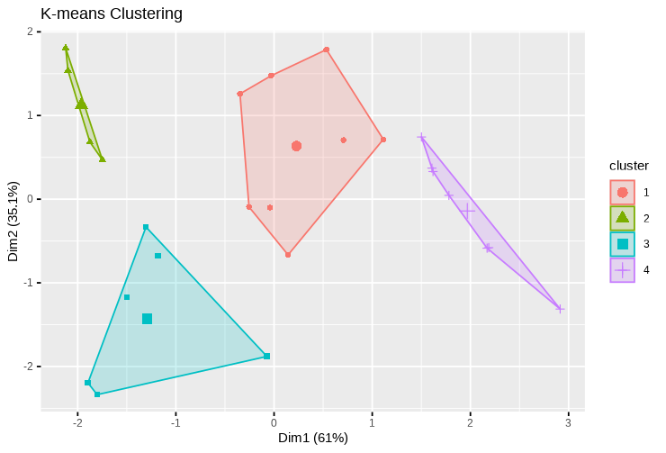
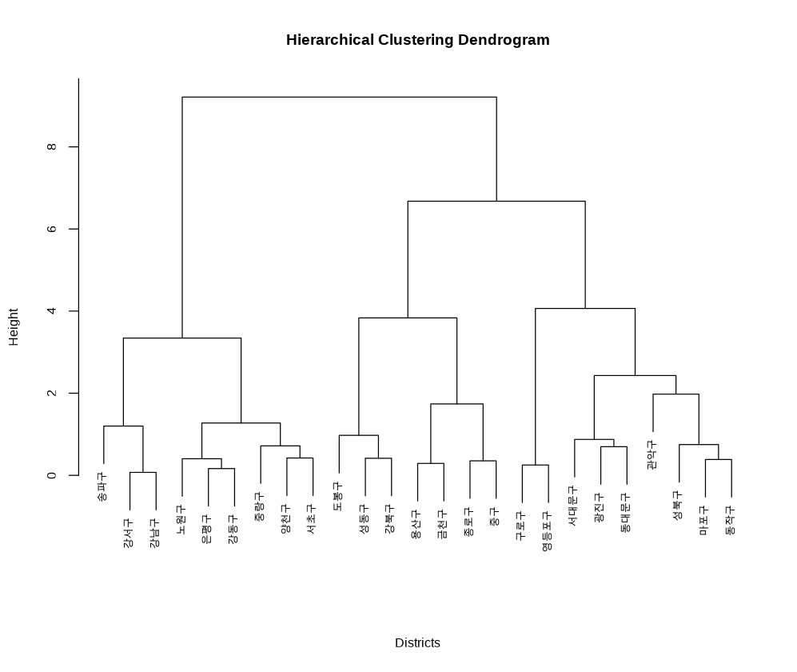

# A Cluster Analysis Study on Seoul’s Administrative Districts Focusing on Registered Foreign Residents

[Click here for the full paper (Korean)](paper.pdf)

## Overview
This document presents a cluster analysis of Seoul's 25 administrative districts based on the distribution and characteristics of registered foreign residents. Using data from the third quarter of 2024, the study aims to identify patterns and group similar districts through statistical techniques. The findings provide insights for designing customized multicultural policies and improving administrative services.

## Objectives
1. Analyze the regional distribution and characteristics of registered foreign residents in Seoul.
2. Identify and group districts with similar characteristics using cluster analysis.
3. Provide actionable insights to guide policy-making for a multicultural and inclusive Seoul.

## Methodology
1. **Data**: 
   - Variables: Population statistics by district, including counts of male and female Korean and foreign residents.
   - Source: Seoul City’s official population statistics (2024 Q3).
2. **Techniques**:
   - **K-Means Clustering**: Categorizes districts into predefined groups based on population data.
   - **Hierarchical Clustering**: Visualizes inter-district similarities and hierarchical relationships using dendrograms.
   - Combined analysis for robust results.

3. **Preprocessing**:
   - Standardized data to eliminate scale discrepancies between variables.

## Key Findings
- **Clusters Identified**: Four distinct clusters emerged, differentiated by foreign resident ratios, economic characteristics, and population distributions.
- **Regional Insights**:
  - High foreign resident areas (e.g., Yongsan, Jongno): Cultural diversity and strong community infrastructure.
  - Low foreign resident areas (e.g., Eunpyeong, Gangbuk): Stable, predominantly local populations.
  - Mixed demographics (e.g., Guro, Dongdaemun): Balance between Korean and foreign populations with thriving multicultural characteristics.
- **Visualization**: Principal Component Analysis (PCA) confirmed clear separations among clusters, explaining 96.1% of data variance.

| **Cluster** | **Districts**                                                                                     |
|-------------|--------------------------------------------------------------------------------------------------|
| 1           | 성동구, 중랑구, 성북구, 강북구, 도봉구, 마포구, 동작구, 서초구                                      |
| 2           | 종로구, 중구, 용산구, 금천구                                                                      |
| 3           | 광진구, 동대문구, 서대문구, 구로구, 영등포구, 관악구                                               |
| 4           | 노원구, 은평구, 양천구, 강서구, 강남구, 송파구, 강동구                                              |

## Applications
- **Policy Recommendations**:
  - High foreign resident regions: Expand multicultural centers, language programs, and support networks.
  - Low foreign resident regions: Improve infrastructure to attract diverse populations.
  - Mixed regions: Foster integration through community-building initiatives.
- **Urban Planning**:
  - Address imbalances by focusing resources on underdeveloped areas.
  - Develop inclusive infrastructure to accommodate multicultural growth.

## Limitations and Future Research
1. **Data Constraints**:
   - Focused solely on registered foreign residents, excluding undocumented populations.
   - Static analysis without accounting for temporal dynamics.
2. **Next Steps**:
   - Incorporate qualitative insights (e.g., interviews, surveys).
   - Analyze temporal trends using longitudinal data.
   - Expand variables (e.g., income, education) for multidimensional clustering.
   - Conduct network analysis to study interactions among districts.

## References
- Seoul Population Statistics: [Link](https://data.seoul.go.kr/dataList/419/S/2/datasetView.do)
- [Huaxing Lin et al., Applied Energy, 2023]
- [Jaejun Jung, Korean Journal of Geography, 2022]
